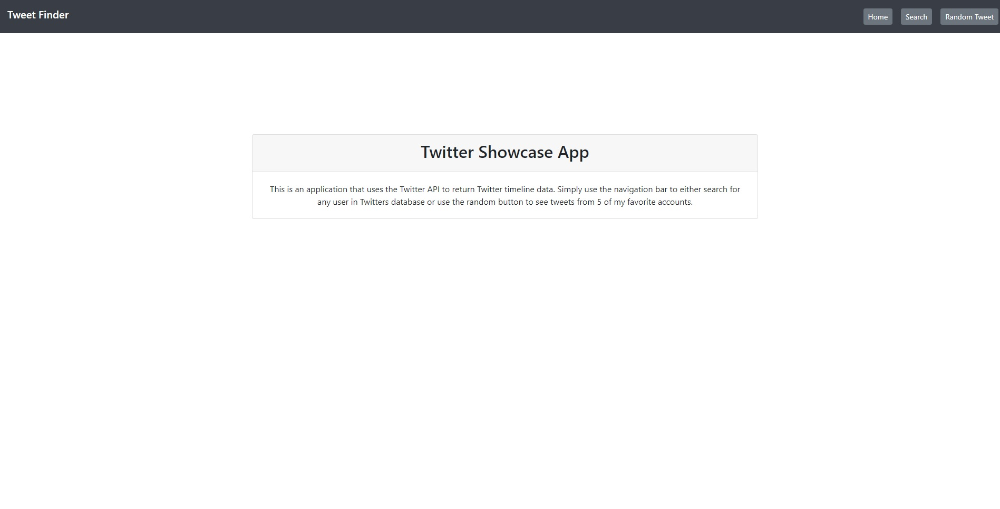
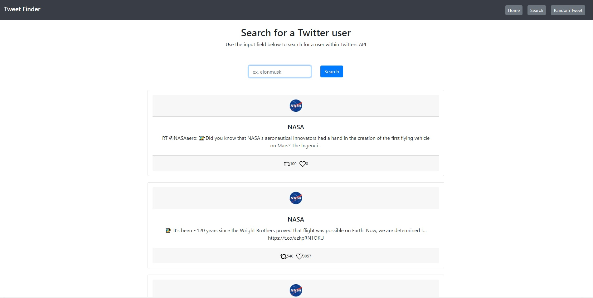
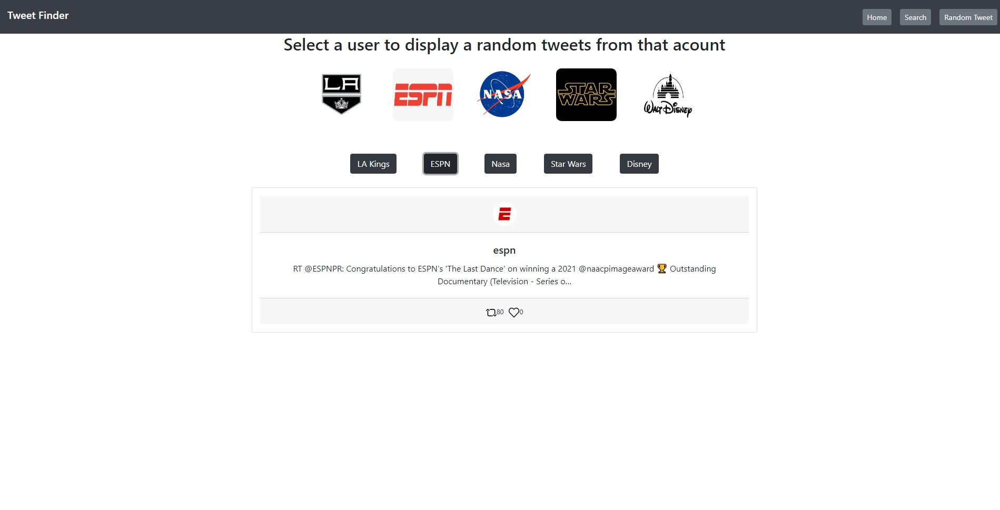

# Twitter Showcase App

An applicatiopn made using Twitters API to return tweet data from specific users. App built using React.js for the client side, Express.js for the back end and Bootstrap 4
for styling. You can check it out [here](https://showcase-twitter-app.herokuapp.com/)

# Functionality

Use the navigation bar to go to either the search or random page.

1. In the search page, use the input field to search for a specific user in twitters database.
   - If no user is returned, the user does not exist.
2. In the Random page, Select from any of the pre-populated users using the correspondign button.
   - Each button will return a random tweet from that user.

In both pages, The tweet that gets returned will have the users profile image, favorites count and
retweet count all in the card.

# Reference Images

# Summary

This application continued my learning into APIs and introduced me to client/server side applicatons. Taking the skills I have accumulated with past projects and applying them
to this full stack application is great insight into how a bigger application would work in modern day companies. Taking what I have learned from this project I will continue to
build more complex projects.

# Author

Cesar Preza - Full Stack Software Developer [LinkedIn](https://www.linkedin.com/in/cesar-preza-72675278/)
